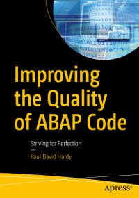

# Apress Source Code

This repository accompanies [*Improving the Quality of ABAP Code*](https://www.apress.com/9781484267103) by Paul David Hardy (Apress, 2021).

[comment]: #cover

Download the files as a zip using the green button, or clone the repository to your machine using Git.

The code is in the format of an offline abapGit repository and instructions on how to upload such a repository into your SAP systems can be found at:

https://docs.abapgit.org/guide-offline-install.html

Instructions on installing abapGit in the first place can be found at:

https://docs.abapgit.org/guide-install.html

## Releases

Release v1.0 corresponds to the code in the published book, without corrections or updates.

## Contributions

See the file Contributing.md for more information on how you can contribute to this repository.
